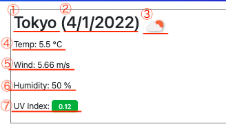

# Weather Dashboard by Yuri

## Purpose
This is a simple weather dashboard for travel lovers. You can check the weather in the city you're planning to go with this dashboard. Quick and Simple!

## Description
* When you enter city name and click search button, current weather conditions and 5-day forecast of the city will be displayed. 
    
    
* Searched cities will be added below the search form and you can view current weather conditions and 5-day forecast by clicking the city. 
    
    
* For current weather conditions, the following items will be displayed:
    1. City Name
    2. Date
    3. Icon representing Weather Condition
    4. Temperature
    5. Wind Speed
    6. Humidity
    7. UV Index (Favorable: Green, moderate: orange, severe: red) 

    
* For 5-day forecast, the following items will be displayed:
    1. Date
    2. Icon representing Weather Condition
    3. Temperature
    4. Wind Speed
    5. Humidity 

    

## Built With
* HTML
* CSS
* Bootstrap
* REMIX ICON
* JavaScript
* jQuery

## Website
https://yurii92.github.io/weather-dashboard-by-yuri/ 

## Contribution
Made with ❤️ by Yuri Ichikawa